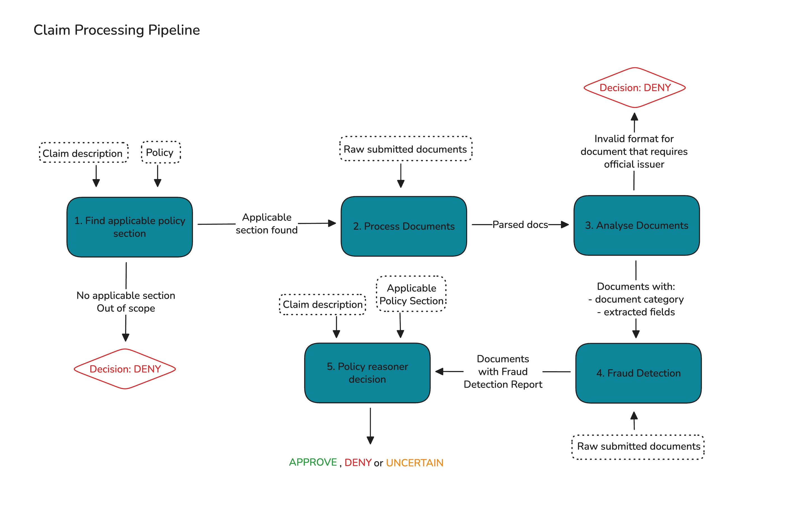

# Solution

## Solution Architecture

The solution is pipeline with a fixed sequence of steps for processing insurance claims.

The pipeline has the following steps:

### 1. Find applicable policy section

The first step of the pipeline is to identify which policy section, if any, applies to the claim. In this case, we have a three possible sections: _Trip Cancellation or Rescheduling_, _Personal Effects_, and _Missed Departure or Missed Connection_. This step uses a LLM call to check the claim against these sections:
- If none match, the claim is considered out of scope and automatically rejected.
- If one matches, that section is saved and passed to a next step for decision-making.

This step acts as both a guardrail and a noise filter, quickly rejecting out-of-scope claims and also reducing the irrelevant information sent to the policy reasoner, which helps improve decision accuracy.

In a real-world scenario, the policy would likely be much larger and more complex. Instead of relying on a single LLM call, a retrieval-based approach (RAG) would make more sense. The policy document would first be split into chunks, ideally each chunk representing an individual policy section and identified by their section title and a short description. Semantic retrieval would then be used to fetch the top-K most relevant sections for a given claim. To further reduce the policy context passed to the decision step, an additional LLM call could optionally be used to select the correct section(s) from those retrieved results.

**Inputs:** Claim description + policy sections

**Output:** Selected policy section (if any) + explanation for why it was chosen

### 2. Process Documents

Claims usually come with documents in non-text formats, so there must be a step to convert everything into machine-readable text.

For most claims in the dataset, the proof of booking is already pre-parsed into markdown and is assumed to be valid. Other documents, such as medical certificates or reports, are submitted as images and require OCR for text extraction.

The text extraction process:
- First checks whether an image is rotated and corrects it if necessary, which makes the extraction more robust.
- PaddleOCR is then used to extract the text. It was chosen because it is fast, reliable, and easy to run locally.

For documents that are already text-based, the content is simply read directly.

**Inputs:** Raw documents (images, PDFs, text)

**Output:** Parsed text from all documents

### 3. Analyse documents

This step focuses on analyzing each parsed document, which involves understanding the document type, performing basic format validity checks, and extracting only the information relevant to the claim, effectively filtering out all irrelevant content

The approach is inspired by how proof-of-booking documents are provided in the dataset. Except for claim 1, the proofs are already in markdown format and contain only the necessary fields as key-value pairs. Comparing these with the raw proof-of-booking document in claim 1 clearly demonstrates the value of an explicit field extraction step.

The first action performed on this step is identifying the document type. Each document is classified into one of the following categories:
1. Medical document
2. Police report
3. Jury summon letter
4. Documentation explaining the cause of a delay
5. Other similar official documents
6. Proof of booking (reservations, tickets, appointments, etc.)
7. None of the above

This classification is important because documents in categories 1–5 are expected to come from an official issuer. These documents must be submitted in a trustworthy format (not plain text like .txt or .md) and should include a signature or stamp. Proofs of booking (category 6) do not undergo this verification, as they are provided in text format that is assumed to be reliable.

The document type is also used to guide information extraction. For each category, a predefined schema specifies which fields are relevant and should be extracted. This field-level extraction is key to keeping the final decision step focused: only information that matters for policy evaluation is passed forward. Feeding the full document text to the policy reasoner would add unnecessary noise and make it easier to miss important details. Text-only documents, including proofs of booking skip this step, as they are already structured as key-value pairs containing only the necessary information.

The effectiveness of this step depends on OCR quality from the previous stage.

**Inputs:** Parsed documents

**Output:** Document analysis, including document category  and relevant fields that matter for the claim

### 4. Fraud detection

This step focuses on detecting basic fraud signals in documents that require an official issuer (categories 1-5). For these documents, this step checks whether a signature or official stamp is present using a Visual Language Model, specifically the quantized `qwen2.5vl:7b-q4_K_M`.

Proofs of booking are excluded from this step, since they are provided as pre-processed markdown and assumed to be trustworthy. In a more complete setup, additional fraud heuristics could also be applied to these documents.

More advanced checks, such as validating the authenticity of the signature, identify visual anomalies, or looking for other suspicious patterns in the document were not implemented here but would be natural next steps.

**Inputs:** Document analysis (including document category) + Raw image documents

**Output:** Fraud detection report with an indicator of missing signature or stamp on critical documents

### 5. Policy Reasoner Decision

This is the final step of the pipeline. It combines the relevant policy section identified earlier (including any exclusions), the claim description, the processed document information (either extracted fields or raw text, depending on the document type) and the fraud detection report.

A LLM then evaluates all of this context and produces a final decision on the claim, along with a short justification explaining how the policy was applied.

**Inputs:** Document analysis (extracted fields from documents) + selected policy section + fraud detection report

**Output:** Decision + explanation

## Reasons Behind Design Decisions

This solution is intentionally designed as a pre-defined, step-by-step pipeline rather than relying on autonomous AI agents. While agent-based approaches - where a model can freely orchestrate tools, iterate, and decide when it has reached an answer - are increasingly popular, I don’t think they are the best fit for this problem.

Insurance claim processing is a high-stakes domain. Each step must be predictable, traceable, and auditable, and certain checks must always run in a specific order. Allowing full model autonomy would make the workflow harder to control, increase the risk of skipped or misapplied checks, and weaken the guarantees around correctness and consistency.

Another key consideration is the use of open-source LLMs running locally. In this setup, every model call needs to be clearly defined and kept as simple as possible. Narrowly scoped, well-constrained prompts make it more likely that models with limited capabilities—and without multimodal support—can perform their tasks reliably.

For these reasons, the system is structured as a sequential pipeline, with each LLM call having a clear responsibility. This prioritizes reliability, traceability, and control over autonomy.

### Note on Generalization vs Reliability

The pipeline is intentionally split into small, focused steps to maximize simplicity and predictability. While highly structured pipelines can be less general than fully autonomous approaches, the steps implemented here are robust enough to handle unseen claims.

In theory, a single call to a very powerful multimodal LLM with a large context window and very good prompt engineering could handle all possible cases and offer maximum generalization. This design instead aims for a middle ground: specialized enough to work reliably for this dataset, while still general enough to adapt to new claims.

## Chosen stack and models

All LLM calls use `qwen3:8b`, running locally via Ollama, with `think` mode disabled for faster generation. The vision language model used for signature/stamp detection is `qwen2.5vl:7b-q4_K_M`, and the OCR model from the PaddleOCR library is the default `PP-OCRv5`. This setup was chosen because these models perform reasonably well while running entirely on my local machine (a MacBook Air M3 with 16 GB RAM), and I do not have access to paid services or API keys for more powerful models.

The pipeline is built in plain Python, and I didn’t use any agent frameworks like LlamaIndex, LangChain, OpenAI Agent SDK, or Google ADK. For this project, with a deterministic step-by-step pipeline, introducing those dependencies didn’t provide any real advantage. The code stays simple, readable, and does exactly what it needs to do.

I also didn’t use a vector database. Given the small size of the policy (as explained in the first step of the pipeline), it wasn’t necessary. In a larger or more complex policy scenario, I would definitely consider chunking the document, ingesting it into a vector database, and retrieving the relevant sections to feed into the policy reasoner.

## Assumptions

A few assumptions were made in this solution:
- All markdown proof-of-booking files are treated as valid and trustworthy. In a real scenario, proofs of booking would need to be in a verifiable format.
- Fraud detection is not applied to proofs of booking because, except for the first claim, they are already processed into markdown with extracted fields. In a real scenario, where proofs of booking could be screenshots, images, or PDFs, fraud detection would need to be applied using appropriate techniques.
- Field extraction is not performed on text documents (markdowns) because, in this dataset, they are always proofs of booking and already contain the relevant extracted fields.

# Ideas for improvements

Several improvements could help increase accuracy, robustness, and generalization for real-world use cases:

- **More Advances Fraud Detection**: Implement additional checks for document inconsistencies, such as mismatched dates, missing or altered information, and signature verification. Consider integrating image forensics to detect manipulated or photoshopped documents.

- **Improved Policy Section Retrieval**: For larger or more complex policies, use a retrieval-based (RAG) approach to fetch the most relevant sections instead of relying on a single LLM call. Consider semantic ranking and context filtering to reduce noise passed to the policy reasoner.

- **Improve Document Processing**: Expand OCR coverage for more complex formats, including handwriting or low-quality scans.

- **Pipeline Optimization and Consolidation**: Evaluate whether certain steps (e.g., document classification + field extraction) can be combined if a more powerful LLM becomes available.
